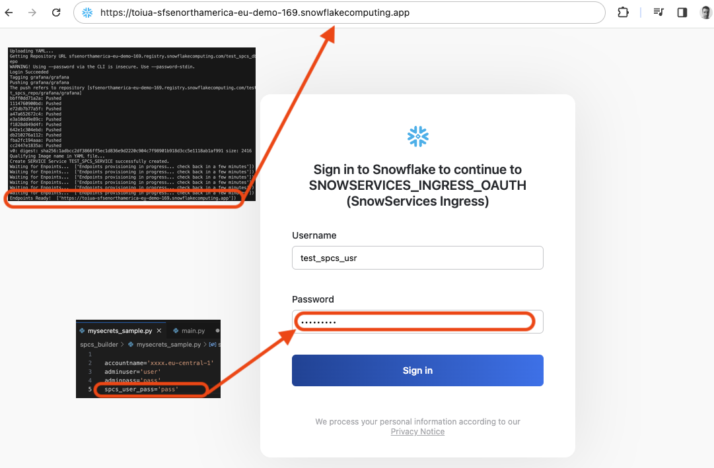
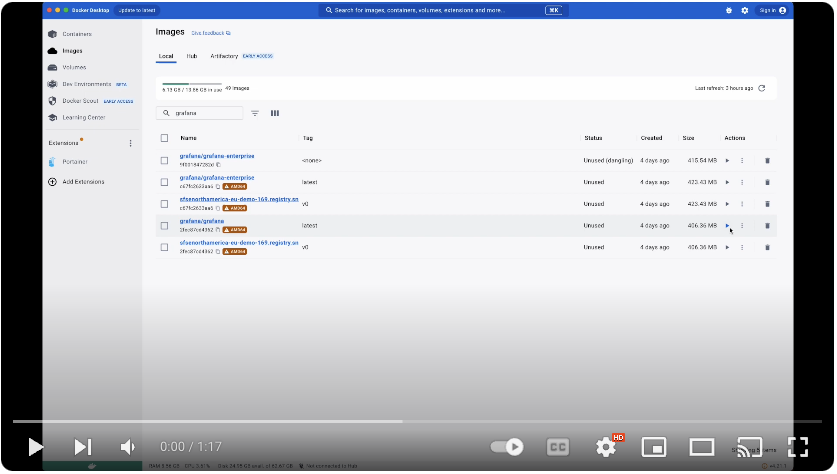

## Purpose

A simple script to push a local docker image and run the container in Snowpark Container Services.

This script has been designed to start testing SPCS from scratch (Snowpark Container Services) in a matter of minutes.

It creates all the necessary elements in a fresh Snowflake account so you can focus on functional aspects

## What do you need?

- A Snowflake AccountAdmin user

- Docker daemon running

- A local docker image

- [The yaml file for running it in SPCS](https://docs.snowflake.com/en/developer-guide/snowpark-container-services/specification-reference)

  

## Before running:

- rename mysecrets_sample.py in mysecrets.py

- Modify the AccountAdmin credentials and account name

    ```
    accountname='locator.region' # like HG792929.eu-central-1
    adminuser='user'
    adminpass='pass'
    spcs_user_pass='pass'
    ```

- Choose a password for the new SCPCS user, user name is hardcoded: test_spcs_usr, change it directly in the code if needed (line 283)

- In main.py, add the prefix for all Snowflake Object creation (line 10):

    app='GRAFANA'

- In main.py, point to your yaml definition file (line 11):

    spcs_yaml_file='yaml/sample_grafana.yaml'

- point to the docker local image(s) name (line 12)

    spcs_docker_image=['grafana/grafana']

  

## Run:

- pip install - r requirements.txt

- python main.py init 

- when enpoint is ready you can navigate to the url and login with the 'test_spcs_usr" user name and choosen password:



If you udpate your code, rebuild your docker image and run:

- python main.py update 

## What the script does for you?

- Create Egress integration

- Create a non-admin user

- Create a role and assign to new user

- Allowing new role to perform service binding

- Create a new Database to host SPCS artefacts

- Create a new Schema

- Create a new Stage for yaml definition

- Create a new Image Repository

- Create Network rule

- Create External Access

- Grant External Access to new role

- Create Compute pool

- Grant Compute pool usage to new role

- Transfer Ownership to new user

- Login to Docker image repo with new user

- Modifying Yaml to include repo path

- Create Service with yaml definition

- Wait for endpoints to be ready

## Example with Grafana image:

[](https://www.youtube.com/watch?v=uPglNirhaxs)
